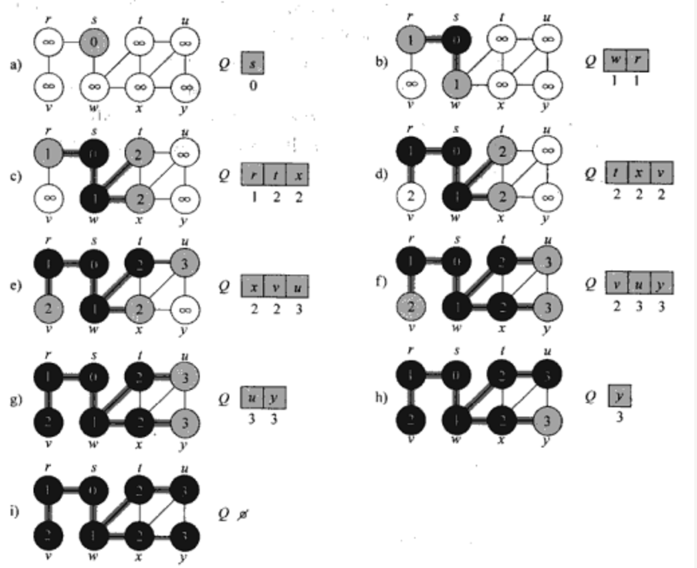
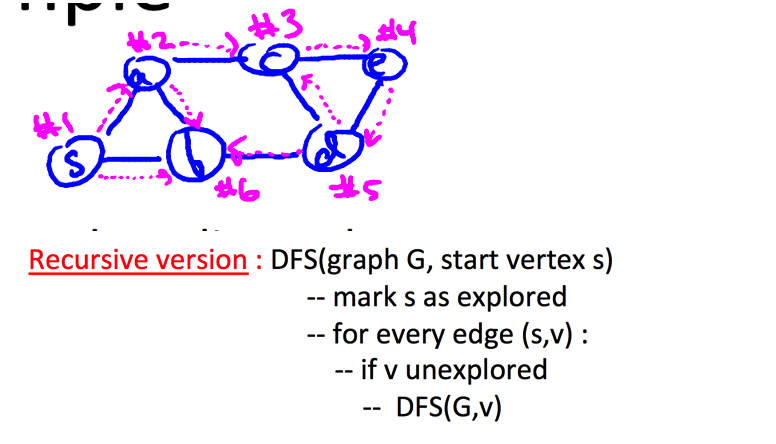
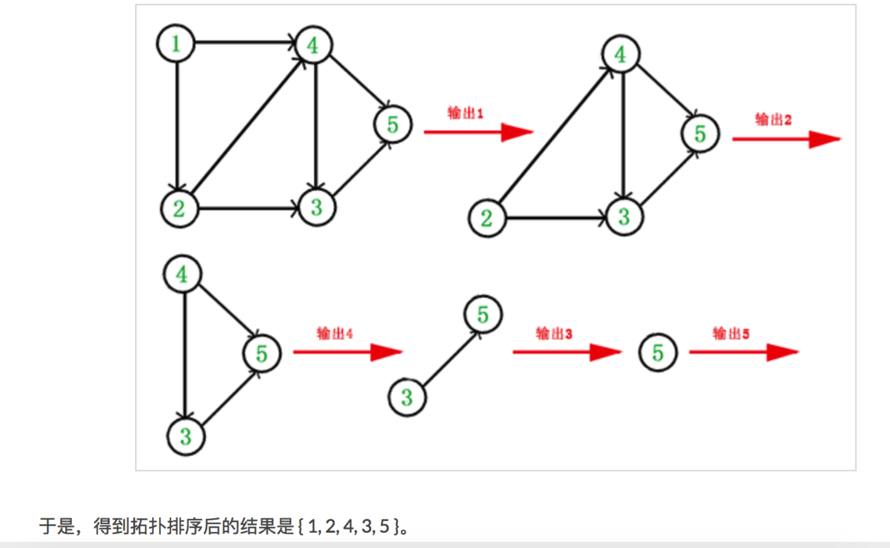
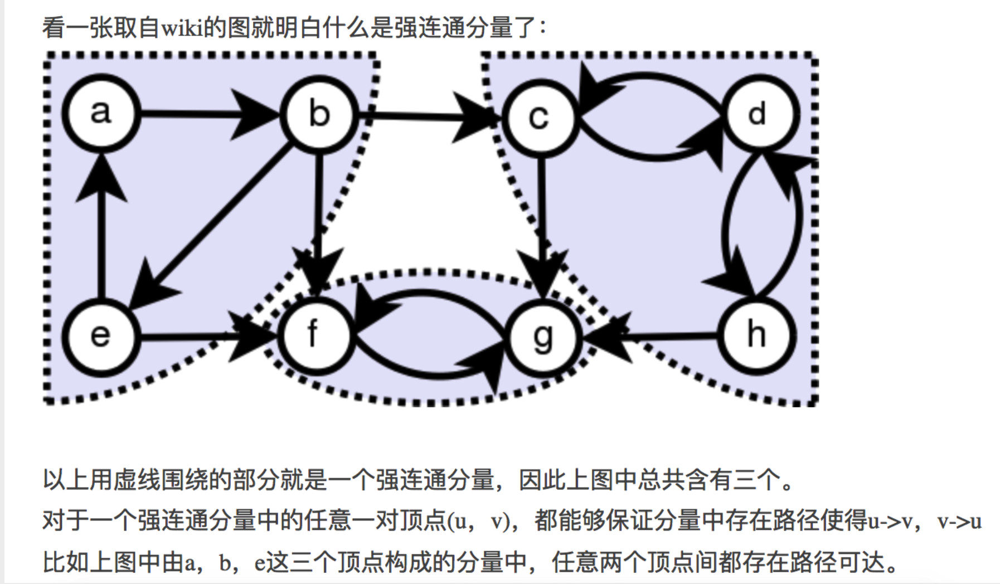
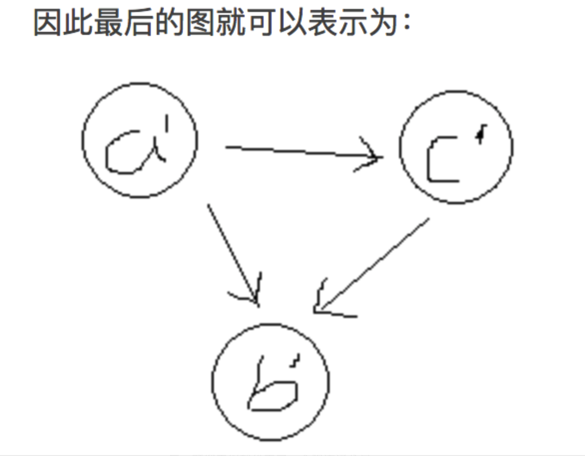
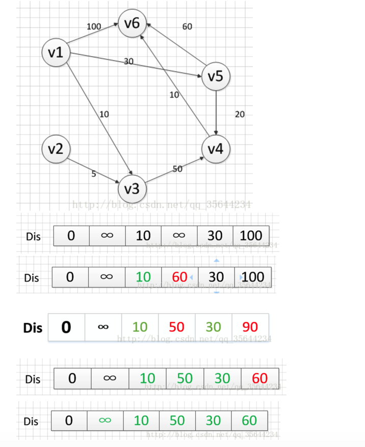
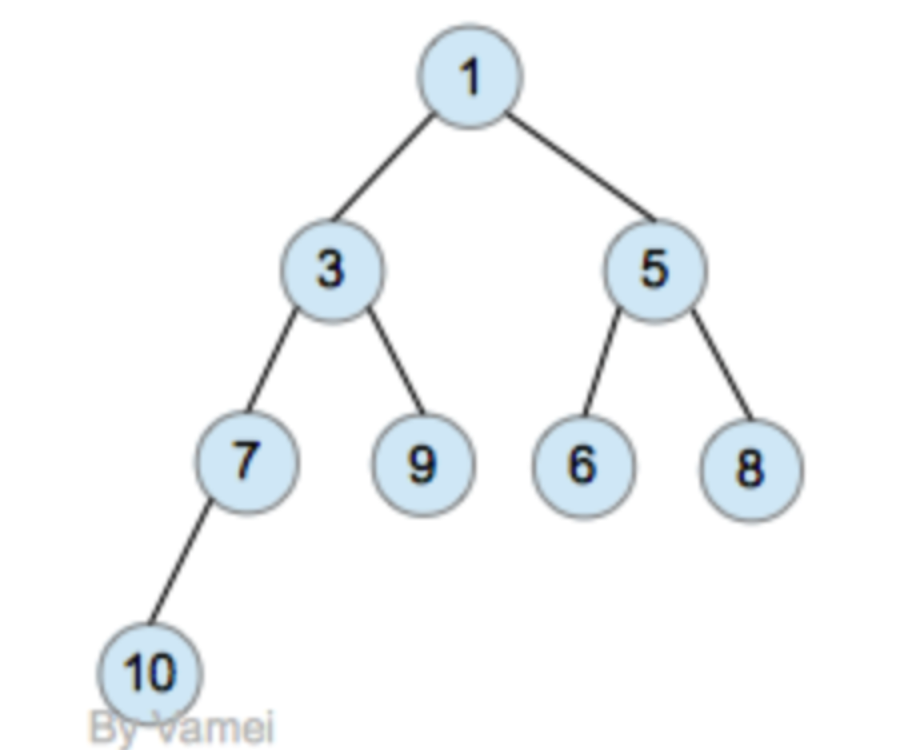

## week1：Graph Primitives
### Breadth-First Search
广度优先遍历BFS（Breadth First Search），其主要思想是从起始点开始，将其邻近的所有顶点都加到一个队列（FIFO）中去，然后标记下这些顶点离起始顶点的距离为1.最后将起始顶点标记为已访问，今后就不会再访问。然后再从队列中取出最先进队的顶点A，也取出其周边邻近节点，加入队列末尾，将这些顶点的距离相对A再加1，最后离开这个顶点A。依次下去，直到队列为空为止。从上面描述的过程我们知道每个顶点被访问的次数最多一次（已访问的节点不会再访问），而对于连通图来说，每个顶点都会被访问。加上每个顶点的邻接链表都会被遍历，因此BFS的时间复杂度是Θ（V+E），其中V是顶点个数，E是边数，也就是所有邻接表中的元素个数。为了更好的说明这个过程，下图列出了对一个图的BFS的过程  

1.  首先将根节点放入队列中。  
2.  从队列中取出第一个节点，并检验它是否为目标。  
        如果找到目标，则结束搜寻并回传结果。  
        否则将它所有尚未检验过的直接子节点加入队列中。  
3.  若队列为空，表示整张图都检查过了——亦即图中没有欲搜寻的目标。结束搜寻并回传“找不到目标”。  
4.  重复步骤2。  
#### Application: Shortest Paths
#### Application: Undirected Connectivity
#### Application: Connected Components

### Depth-First Search
DFS（Depth First Search）深度优先搜索是从起始顶点开始，递归访问其所有邻近节点，比如A节点是其第一个邻近节点，而B节点又是A的一个邻近节点，则DFS访问A节点后再访问B节点，如果B节点有未访问的邻近节点的话将继续访问其邻近节点，否则继续访问A的未访问邻近节点，当所有从A节点出去的路径都访问完之后，继续递归访问除A以外未被访问的邻近节点。因为是递归过程，所以我们用过程图看一下也许会更直观一些.  
  

#### Application: Topological Sort
### 拓扑排序（Topological Sorting）
在图论中，拓扑排序（Topological Sorting）是一个有向无环图（DAG, Directed Acyclic Graph）的所有顶点的线性序列。且该序列必须满足下面两个条件：  
1. 每个顶点出现且只出现一次。  
2. 若存在一条从顶点 A 到顶点 B 的路径，那么在序列中顶点 A 出现在顶点 B 的前面。  
有向无环图（DAG）才有拓扑排序，非DAG图没有拓扑排序一说。 

  

1. 从 DAG 图中选择一个 没有前驱（即入度为0）的顶点并输出。  
2. 从图中删除该顶点和所有以它为起点的有向边。  
3. 重复 1 和 2 直到当前的 DAG 图为空或当前图中不存在无前驱的顶点为止。后一种情况说明有向图中必然存在环。  
通常，一个有向无环图可以有一个或多个拓扑排序序列。  
##### opological-Sort算法实现思路：
<1>调用DFS去搜索有向无回路图并记录每一个顶点的finishTime，也就是记录在DFS遍历过程中每个顶点的完成时间；  
<2>当每个顶点完成时，将其从一个链表的头部插入（开始时简历一个空链表，每完成一个顶点便从链表头部插入）；  
<3>当DFS遍历结束后，返回这个链表便是有向无回路图的拓扑排序。  
Topological-Sort算法的时间复杂度是O(V+E)，也是深度优先搜索的时间复杂度，因为算法中将|V|个顶点插入到链表中所用的时间O(1)。
#### Application: Strongly Connected Components
在图论中，一个有向图被成为是强连通的（strongly connected）当且仅当每一对不相同结点 u 和 v 间既存在从 u 到 v 的路径也存在从 v 到 u 的路径。有向图的极大强连通子图（这里指点数极大）被称为强连通分量（strongly connected component）。

  

##### 顺便也介绍一下有关“缩点”的概念：
由于强连通分量的特殊性，在一些实际应用中，会将每个强连通分量看成一个点，然后进行处理。这样做主要是为了降低图的复杂度，特别是在强连通分量规模大、数量多的情况中，利用“缩点”能大幅度降低图的复杂度。缩点后得到的图，必定是DAG。用反正能够很方便的进行证明：因为若图中含有环路，即意味着至少有两个点彼此可达，那么按照强连通分量的定义，这两个点应该属于一个分量中，因而在缩点发生后，会被一个点所代表。由此推导出矛盾。比如，对上图进行缩点处理，最后的结果就是：
设(a，b，c) -> a'，(f，g) -> b'，(c，d，h) -> c’  
  

##### 回顾一下Kosaraju的主要步骤：  
对GR求解tomopologic sort，即上文中的”伪拓扑排序“（先遍历取下游子节点，并压入栈中，再取根节点。最终出栈顺序即为拓扑排序）  
对G进行转置得到GR  
按照第一步得到的集合中顶点出现的顺序，对GR调用DFS得到若干颗搜索树  
每一颗搜索树就代表了一个强连通分量  
坦率地说，这个算法的想法很巧妙，为了突出回向边，而对图进行转置，然后对转置的图按照之前得到的顶点序列进行DFS调用。整个算法的确能够正确工作，但是总感觉怪怪的，确实，这个算法不太好理解，尽管它的实现十分简单直观。

## week2：Dijkstra’s Algorithm
tips1：如果各边的权重都一样，例如都是1，那bfs即可以计算Shortest Paths  
tips2：如果各边权重不一样，就得需要Dijkstra’s Algorithm  
Dijkstra算法采用的是一种贪心的策略，且Dijkstra只使用于图的边权重均为非负数。  
步骤：   
1、声明一个数组dist来保存源点到各个顶点的最短距离，一个数组T来保存已经找到了最短路径的顶点集合  
2、将源点可直接到达的顶点各边权重更新到dist中，源点到自己的权重是0，对于不能直接到达的顶点，距离为无穷大。T中加入源点的顶点。  
3、从dist中选取源点到该顶点（除掉在数组T中的）的最小值，该值就是源点s到该顶点sx的最短路径，并将该顶点加入到T中，T=[s,sx]，完成一个顶点。  
4、根据新加入的点的出度，看s到其他点的距离，是否可以更近，如果更近，则更新dist中源点s到该点的值。例如：s->sx为10，s->sy为40，sx->sy为20，则需要将dist中s->sy的值改为30。  
5、重复步骤3，直到将所有顶点加入到T中。  
  

### heap优化算法
主要思想是：提高每次查找从dist中选取源点到该顶点（除掉在数组T中的）的最小值的效率，比如用队列，每次pop出最小权重的顶点，就免去了使用T的冗余，直接将dist变成有序递增的。  

1、每次在没标记的节点中找离源点最近的,此步骤可以用HEAP维护,每次取根(最小值),然后删除根,在其左右子节点中选更小的作为堆的根,但此时选中的子树有无根了,递归处理.  
2、找到最近点后,要更新各点离源点的距离,若能更新,则该点的值变小了,可能比其父亲更小,与其比较,更小就交换,不断往上比较,直到是整个堆的根或不比父亲小.  

## week3:Data Structures:heaps
堆(heap)又被为优先队列(priority queue)。尽管名为优先队列，但堆并不是队列。回忆一下，在队列中，我们可以进行的限定操作是dequeue和enqueue。dequeue是按照进入队列的先后顺序来取出元素。而在堆中，我们不是按照元素进入队列的先后顺序取出元素的，而是按照元素的优先级取出元素。  
堆的一个经典的实现是完全二叉树(complete binary tree)。这样实现的堆成为二叉堆(binary heap)。  
完全二叉树是增加了限定条件的二叉树。假设一个二叉树的深度为n。为了满足完全二叉树的要求，该二叉树的前n-1层必须填满，第n层也必须按照从左到右的顺序被填满。 
  

为了实现堆的操作，我们额外增加一个要求: 任意节点的优先级不小于它的子节点。如果在上图中，设定小的元素值享有高的优先级，那么上图就符合该要求。  
堆的主要操作是插入和删除最小元素(元素值本身为优先级键值，小元素享有高优先级)。在插入或者删除操作之后，我们必须保持该实现应有的性质: 1. 完全二叉树 2. 每个节点值都小于或等于它的子节点。  
在插入操作的时候，会破坏上述堆的性质，所以需要进行名为percolate_up（通过将新元素与父节点调整交换的操作叫做上滤）的操作，以进行恢复。新插入的节点new放在完全二叉树最后的位置，再和父节点比较。如果new节点比父节点小，那么交换两者。交换之后，继续和新的父节点比较…… 直到new节点不比父节点小，或者new节点成为根节点。这样得到的树，就恢复了堆的性质。  
删除操作只能删除根节点。根节点删除后，我们会有两个子树，我们需要基于它们重构堆。进行percolate_down（下滤）的操作: 让最后一个节点last成为新的节点，从而构成一个新的二叉树。再将last节点不断的和子节点比较。如果last节点比两个子节点中小的那一个大，则和该子节点交换。直到last节点不大于任一子节点都小，或者last节点成为叶节点。  
#### application：Median Maintenence
借用“堆”这一数据结构，可以让算法的时间复杂度大大降低。具体的思路如下：  
* 创建两个堆：最大堆和最小堆（最大堆即父节点大于子节点的堆，反之则是最小堆）；  
* 先初始化一个median，比如第一个数字（这个不重要，最终的中位数都还是一样的）  
* 每次读入一个数后，我们将它和之前的median大小进行比较，如果大于median，那么就把它插入到最小堆当中；反之，就插入最大堆当中。可以想象一下，通过这个操作，比median大的数字都在最小堆的根节点之下，而比median小的数字，都在最大堆的根节点之下；  
* 有了上述结论后，我们还不能保证中位数就在两个根节点中，因为两个堆的大小可能会差的很大，因此每次读入一个数并且插入相应的堆后，我们都要检查两个堆的大小，然后平衡他们的大小（只有在两个堆的大小差异不大于1的情况下， 中位数才是两个根节点中的一个）  
* 平衡的具体做法是：如果两个堆的大小差异超过了1，那么就把size较大的那个堆的根节点pop出来，并将其插入到size较小的堆中，并且将那个堆的根节点pop的值赋给median；  
* 最后就是计算中位数了，因为最小堆的根节点会大于最大堆的根节点，因此如果最小堆的size比最大堆大1，那么中位数就是最小堆根节点；如果两者大小相等，或者最大堆的size比最小堆大1，那么中位数就是最大堆的根节点。  
#### 二叉树与堆的区别和一些类别：
1、二叉树是 n (n >= 0)个结构的有限集合,改集合或者为空集(称为空二叉树),或者有一个根节点和两棵互不相交的、分别称为根节点的左子树和右子树的二叉树组成.  
2、
 完美二叉树
Perfect Binary Tree 
Every node except the leaf nodes have two children and every level (last level too) is completely filled. 除了叶子结点之外的每一个结点都有两个孩子，每一层(当然包含最后一层)都被完全填充。
完全二叉树
Complete Binary Tree 
Every level except the last level is completely filled and all the nodes are left justified. 除了最后一层之外的其他每一层都被完全填充，并且所有结点都保持向左对齐。
完满二叉树
Full/Strictly Binary Tree 
Every node except the leaf nodes have two children. 除了叶子结点之外的每一个结点都有两个孩子结点。
堆（heap）看起来像一种完全二叉树，可以用数组来存储。但堆的子节点是不分左右的，只是和父节点是有区分的。（最大堆是指父节点大于任何自己的子节点，即根节点最大，最小堆是父节点小于任何自己的子节点，即根节点最小）实质上是满足如下性质的完全二叉树：
一个数组a[N]共N个元素, 设2k+1 < N（K为所有的根节点）,如果a[k] >= a[2k + 1] 且a[k] >= a[2k+2]，则该堆为大顶堆。
二叉排序树（Binary Sort Tree），又称二叉查找树（Binary Search Tree），亦称二叉搜索树。
二叉排序树或者是一棵空树，或者是具有下列性质的二叉树：  
（1）若左子树不空，则左子树上所有结点的值均小于或等于它的根结点的值；  
（2）若右子树不空，则右子树上所有结点的值均大于或等于它的根结点的值；  
（3）左、右子树也分别为二叉排序树；  

### Binary Search Tree(二叉查找树)
二叉查找树（Binary Search Tree），也称有序二叉树（ordered binary tree）,排序二叉树（sorted binary tree），是指一棵空树或者具有下列性质的二叉树：  
1. 若任意节点的左子树不空，则左子树上所有结点的值均小于它的根结点的值；  
2. 若任意节点的右子树不空，则右子树上所有结点的值均大于它的根结点的值；  
3. 任意节点的左、右子树也分别为二叉查找树。  
4. 没有键值相等的节点（no duplicate nodes）。  
Searching
查找操作和二分查找类似，将key和节点的key比较，如果小于，那么就在Left Node节点查找,如果大于，则在Right Node节点查找，如果相等，直接返回Value。
BST 算法查找时间依赖于树的拓扑结构。最佳情况是 O(log­2n)，而最坏情况是 O(n)。
Insertion
插入和查找类似，首先查找有没有和key相同的，如果有，更新；如果没有找到，那么创建新的节点。并更新每个节点的Number值.
BST 的插入算法的复杂度与查找算法的复杂度是一样的：最佳情况是 O(log­2n)，而最坏情况是 O(n)。
Min, Max
二叉查找树中，最左和最右节点即为最小值和最大值，所以我们只需迭代调用即可。
Deletion
当删除的节点没有子节点时，直接将该父节点指向该节点的link设置为null。  
当删除的节点只有1个子节点时，将该自己点替换为要删除的节点即可。  
当删除的节点有2个子节点时，问题就变复杂了。假设我们删除的节点t具有两个子节点。因为t具有右子节点，所以我们需要找到其右子节点中的最小节点，替换t节点的位置。这里有四个步骤：  
1. 保存带删除的节点到临时变量t  
2. 将t的右节点的最小节点min(t.right)保存到临时节点x  
3. 将x的右节点设置为deleteMin(t.right)，该右节点是删除后，所有比x.key最大的节点。  
4. 将x的做节点设置为t的左节点。  
删除算法的运行时间也与 BST 的拓扑结构有关，最佳情况是 O(log­2n)，而最坏情况是 O(n)  

#### In-Order Traversal

* 前序遍历（Perorder traversal）  
1、访问节点 c；  
2、对节点 c 的左孩子重复第 1 步；  
3、对节点 c 的右孩子重复第 1 步；  
则上图中树的遍历结果为：90, 50, 20, 5, 25, 75, 66, 80, 150, 95, 92, 111, 175, 166, 200。  
* 中序遍历（Inorder traversal）  
1、访问节点 c 的左孩子；  
2、对节点 c 重复第 1 步；  
3、对节点 c 的右孩子重复第 1 步。  
则上图中树的遍历结果为：5, 20, 25, 50, 66, 75, 80, 90, 92, 95, 111, 150, 166, 175, 200。  
* 后序遍历（Postorder traversal）  
1、访问节点 c 的左孩子；  
2、对节点 c 的右孩子重复第1 步；  
3、对节点 c 重复第 1 步；  
则上图中树的遍历结果为：5, 25, 20, 66, 80, 75, 50, 92, 111, 95, 166, 200, 175, 150, 90。  
### 自平衡二叉查找树（Self-Balancing Binary Search Tree）  
AVL Tree  
在 1962 年，俄罗斯数学家 G. M. Andel'son-Vel-skii 和 E. M. Landis 发明了第一种自平衡二叉查找树，叫做 AVL 树。AVL 树必须维持如下平衡条件，对每个节点 n：  
* 节点 n 的左子树的高度与右子树的高度的差至多是 1。  
节点的左子树或者右子树的高度可以通过上面描述的步骤来计算。如果节点仅有一个子节点，则无子节点侧的高度为 -1。  

AVL 树通过 "旋转操作（rotations）" 来保持树的平衡。旋转操作可以重塑树的拓扑结构来恢复树的平衡，更重要的是，重塑后的树依然符合二叉查找树的性质要求。  
最重要的就是要意识到插入操作和删除操作都会破坏 AVL 树的平衡，而旋转操作就是解决这些问题的法宝。  
通过确保所有节点的左右子树的差小于等于 1，AVL 树保证了插入、删除和查找操作将始终保持 O(log2n) 的渐进运行时间，而与插入或删除节点的顺序无关。  
### Red-Black Tree
红黑树（R-B Tree）需要满足如下性质：  
1、节点的颜色只能是红色或者黑色；  
2、根节点是黑色的；（根性质）  
3、所有叶子都是黑色（ [注意：这里叶子节点，是指为空(NIL或NULL)的叶子节点！]）。  
4、如果节点的颜色是红色，则其子节点均为黑色；（红性质）  
5、从任一节点到其后代任一叶子节点的路径上的黑色节点的数量相同；（黑性质）  
If a node is red, then its parent is black  

红黑树则是通过重新着色（recoloring）和旋转（rotations）两种操作共同来完成树的平衡。这不仅需要判断节点的父节点的颜色，还需要对比叔父节点的颜色，使得红黑树的恢复过程变得更加复杂。  
树的旋转分为左旋和右旋，下面借助图来介绍一下左旋和右旋这两种操作。  

树在经过左旋右旋之后，树的搜索性质保持不变，但树的红黑性质则被破坏了，所以，红黑树插入和删除数据后，需要利用旋转与颜色重涂来重新恢复树的红黑性质。  
Insertion
case1:如果树 T 为空，则可直接将节点 K 设置为根节点，并且将颜色标为黑色，这样即可满足 R-B 树的所有要求。  
case2:如果树 T 不为空，则需要遵循如下步骤：  
第一步: 将红黑树当作一颗二叉查找树，将节点插入。  
第二步：将插入的节点着色为"红色”。（定义成红色则不会违反特性5（黑性质））  
第三步: 通过一系列的旋转或着色等操作，使之重新成为一颗红黑树。  

上面三种情况(Case)处理问题的核心思路都是：将红色的节点移到根节点；然后，将根节点设为黑色。下面对它们详细进行介绍。  
情况1：z的爸爸和叔叔是红色  
新节点z是左孩子还是右孩子都一样，分别见（a）（b）  

此时我们只需将 z的父亲和叔叔着色为黑，并将z的爷爷着色为红，即可解决节点z和
其父亲都为红色带来对属性4的破坏，且不会带来新的属性破坏。但问题并没有就此解决，因
为z的麻烦虽然解决，但却转移到了它的爷爷身上，它的爷爷同样面临着可能与它的父亲
同为红色的问题。不过没关系，让z的爷爷成为新的z吧，我们再以新z的来修复属性。
好在即使问题一直存在，但却不断在向根结点移动，最终，我们可以简单的将根结点设置为黑
就能解决了。  
情况2：z的爸爸是红色，叔叔是黑色，且z是右孩子  
对于情况2，当前结点的父结点做为新的当前结点，以新当前结点为支点左旋，这样就可以快速的将情况2转化为情况3了

情况3：z的爸爸是红色，叔叔是黑色，且z是左孩子  
对于情况3，我们将其父亲着色为黑，其爷爷着色为红，并对其爷爷进行一次右旋操作，此时在并不破坏其它属性的情况下，可以解决属性4冲突的问题。 

Deletion
删除操作首先需要做的也是BST的删除操作，再设置替代该节点的新节点为当前节点，并进行调整。删除操作会删除对应的节点，如果是叶子节点就直接删除，如果是非叶子节点，会用对应的中序遍历的后继节点来顶替要删除节点的位置。删除后就需要做删除修复操作，使的树符合红黑树的定义，符合定义的红黑树高度是平衡的。
删除修复操作在遇到被删除的节点是红色节点或者到达root节点时，修复操作完毕。
删除操作的总体思想是从兄弟节点借调黑色节点使树保持局部的平衡，如果局部的平衡达到了，就看整体的树是否是平衡的，如果不平衡就接着向上追溯调整。
下面我们用一个分析技巧：我们从被删结点后来顶替它的那个结点开始调整，并认为它有额外的一重黑色。这里额外一重黑色是什么意思呢，我们不是把红黑树的结点加上除红与黑的另一种颜色，这里只是一种假设，我们认为我们当前指向它，因此空有额外一种黑色，可以认为它的黑色是从它的父结点被删除后继承给它的，它现在可以容纳两种颜色，如果它原来是红色，那么现在是红+黑，如果原来是黑色，那么它现在的颜色是黑+黑。有了这重额外的黑色，原红黑树性质5就能保持不变。现在只要恢复其它性质就可以了，做法还是尽量向根移动和穷举所有可能性。
删除修复操作分为四种情况(删除黑节点后)：  
1. 待删除的节点的兄弟节点是红色的节点。  
2. 待删除的节点的兄弟节点是黑色的节点，且兄弟节点的子节点都是黑色的。  
3. 待调整的节点的兄弟节点是黑色的节点，且兄弟节点的左子节点是红色的，右节点是黑色的(兄弟节点在右边)，如果兄弟节点在左边的话，就是兄弟节点的右子节点是红色的，左节点是黑色的。  
4. 待调整的节点的兄弟节点是黑色的节点，且右子节点是是红色的(兄弟节点在右边)，如果兄弟节点在左边，则就是对应的就是左节点是红色的。  
删除修复情况1：当前结点是黑+黑且兄弟结点为红色(此时父结点和兄弟结点的子结点分为黑)。  
把父结点染成红色，把兄弟结点染成黑色，对兄弟节点做左旋操作。之后重新进入算法（我们只讨论当前结点是其父结点左孩子时的情况）。此变换后原红黑树性质5不变，而把问题转化为兄弟结点为黑色的情况(注：变化前，原本就未违反性质5，只是为了把问题转化为兄弟结点为黑色的情况)。  

删除修复情况2：当前结点是黑加黑且兄弟是黑色且兄弟结点的两个子结点全为黑色。  
把当前结点和兄弟结点中抽取一重黑色追加到父结点上，兄弟节点变成红色，把父结点当成新的当前结点，重新进入算法。（此变换后性质5不变）  

删除修复情况3：当前结点颜色是黑+黑，兄弟结点是黑色，兄弟的左子是红色，右子是黑色。  
把兄弟结点染红，兄弟左子结点染黑，之后再在兄弟结点为支点右旋，之后重新进入算法。此是把当前的情况转化为情况4，而性质5得以保持  

删除修复情况4：当前结点颜色是黑-黑色，它的兄弟结点是黑色，但是兄弟结点的右子是红色，兄弟结点左子的颜色任意。  
把兄弟结点染成当前结点父结点的颜色，把当前结点父结点染成黑色，兄弟结点右子染成黑色，之后以当前结点的父结点为支点进行左旋，此时算法结束，红黑树所有性质调整正确。

## week4:Hashtable
哈希表就是一种以 键-值(key-indexed) 存储数据的结构，我们只要输入待查找的值即key，即可查找到其对应的值。

在Java中最常用的两种结构是数组和链表，其中，数组的特点是：寻址容易，插入和删除困难；而链表的特点是：寻址困难，插入和删除容易。Hashtable和HashMap综合了两者的特性，是一种寻址容易、插入和删除也容易的数据结构。实际上，Hashtable和HashMap本质上都是一个 链表数组  
Hashtable和HashMap的不同：  
Hashtable不同于HashMap，前者既不允许key为null，也不允许value为null  
HashMap中用于定位桶位的Key的hash的计算过程要比Hashtable复杂一点，没有Hashtable如此简单、直接；  
在HashMap的插入K/V对的过程中，总是先插入后检查是否需要扩容；而Hashtable则是先检查是否需要扩容后插入；  
Hashtable不同于HashMap，前者的put操作是线程安全的。  

Hashtable包括五个成员变量:
Entry数组table： 一个由Entry对象组成的链表数组，table数组的每一个数组成员就是一个链表；  
Entry个数count： Hashtable中Entry对象的个数；  
阈值threshold： Hashtable进行扩容的阈值；  
负载因子loadFactor： 在其容量自动增加之前可以达到多满的一种尺度，默认为0.75；  
结构性修改次数modCount： 记录Hashtable生命周期中结构性修改的次数，便于快速失败(所谓快速失败是指其在并发环境中进行迭代操作时，若其他线程对其进行了结构性的修改，这时迭代器能够立马感知到并且立即抛出ConcurrentModificationException异常，而不是等到迭代完成之后才告诉你（你已经出错了）)；  

#### Hashtable数据结构：

#### Hashtable 的存储实现

#### Hashtable 的重哈希操作

使用哈希查找有两个步骤:
1. 使用哈希函数将被查找的键转换为数组的索引。在理想的情况下，不同的键会被转换为不同的索引值，但是在有些情况下我们需要处理多个键被哈希到同一个索引值的情况。所以哈希查找的第二个步骤就是处理冲突  
2. 处理哈希碰撞冲突。有很多处理哈希碰撞冲突的方法，本文后面会介绍拉链法和线性探测法。  
哈希表是一个在时间和空间上做出权衡的经典例子。如果没有内存限制，那么可以直接将键作为数组的索引。那么所有的查找时间复杂度为O(1)；如果没有时间限制，那么我们可以使用无序数组并进行顺序查找，这样只需要很少的内存。哈希表使用了适度的时间和空间来在这两个极端之间找到了平衡。只需要调整哈希函数算法即可在时间和空间上做出取舍。  
### 避免哈希冲突
#### 拉链法 (Separate chaining with linked lists)

该方法的基本思想就是选择足够大的M，使得所有的链表都尽可能的短小，以保证查找的效率。对采用拉链法的哈希实现的查找分为两步，首先是根据散列值找到等一应的链表，然后沿着链表顺序找到相应的键。

#### 开放寻址法（Open addressing）

### Hash Function
一个好的散列函数 h()必须兼顾以下两条基本要求：  
h( )应该尽可能接近单射；  
对于任何关键码 key，h(key)的计算必须能够在 O(1)时间内完成。  
关于散列函数的计算，Java有其特有的习惯。Java将h(key)的计算划分为两步：  
（1）将一般性的关键码key转换为一个称作“散列码”的整数；  
（2）然后再通过所谓的“压缩函数”将该整数映射至区间[0..N-1]内。  

Java 内建的 java.util.HashMap 类实现了映射结构的 ADT，在创建该类的对象时，程序员可以指定负载因子(load factor)的上限（默认设置为 0.75）。一旦装填因子超出这一范围，java.util.HashMap会自动进行重散列（Rehashing）。

对Hashtable的分析，可参照java 8 和Redis的源码来分析
https://bestswifter.com/hashtable/
Redis：
Redis 是一个高效的 key-value 缓存系统，也可以理解为基于键值对的数据库。

#### Application: De-Duplication
#### Application: The 2-SUM Problem
determine whether or not there are two numbers x,y in A with    x+y=t  
1/   insert elments of A into hash table         O(n)  
2/       for each x in A     Lookup t-x            O(n)  
### 全域哈希法（Universal Hashing）
Idea is：choose hash function at random independen t from keys，这正是所谓的 universal hashing（全域hash）
哈希函数的所有键有可能会映射同一个槽，此时查询效率极为低下。  
  (1)、问题关键：选择哈希函数，要随机选择，与输入的哈希运算的键保存独立，程序员本身也不能确定在实际运行时会用到哪一个哈希函数，无法预测随机数的输出；----->全域哈希  
 (2)、全域哈希解决的问题：所有键都相同，此时随机选择哈希函数将会使其映射到不同的槽中；  
哈希函数集H中随机地选择函数h，均匀的分布在哈希表中；  
(3)、全域哈希的构造：
i、槽的总数为m = 质数时成立，k = <k_0,k_1,.....,k_r>把任意的键分解为r+1位，可以把k看成k_0，k_1......k_r(k_i >= 0 && k_i <= m-1)，k用"m进制"来表示；k不断除m，取余在除(进制转换法)  
ii、构造一个a = <a0,a1,a2....ar>，随机地从(0,1,2,....m-1)中选取元素分配到a集合中；  
哈希函数集：k x a，k中的每一项和a中的每一项相乘，再把乘积全部加起来，在对m取余，就得到分配的槽数；哈希函数集的大小：m^(r+1)；  
  H[a](k) = sum { a[i] * k[i] }  mod m    i =0, 1, ... , m-1  

(4)、全域哈希是用随机函数的思想，但是有很小很小的概率还是会冲突的，解决方案：完全哈希；

### 完美哈希（Perfect Hashing）

Bloom Filters
Bloom-Filter，即布隆过滤器，1970年由Bloom中提出。它可以用于检索一个元素是否在一个集合中。  
Bloom Filter（BF）是一种空间效率很高的随机数据结构，它利用位数组很简洁地表示一个集合，并能判断一个元素是否属于这个集合。它是一个判断元素是否存在集合的快速的概率算法。Bloom Filter有可能会出现错误判断，但不会漏掉判断。也就是Bloom Filter判断元素不在集合，那肯定不在。如果判断元素存在集合中，有一定的概率判断错误。因此，Bloom Filter不适合那些“零错误”的应用场合。而在能容忍低错误率的应用场合下，Bloom Filter比其他常见的算法（如hash，折半查找）极大节省了空间。 
它的优点是空间效率和查询时间都远远超过一般的算法，缺点是有一定的误识别率和删除困难。  
Bloom-Filter算法的核心思想就是利用多个不同的Hash函数来解决“冲突”。  

创建一个m位BitSet，先将所有位初始化为0，然后选择k个不同的哈希函数。第i个哈希函数对字符串str哈希的结果记为h（i，str），且h（i，str）的范围是0到m-1 。

下面是检查字符串str是否被BitSet记录过的过程：
对于字符串str，分别计算h（1，str），h（2，str）…… h（k，str）。然后检查BitSet的第h（1，str）、h（2，str）…… h（k，str）位是否为1，若其中任何一位不为1则可以判定str一定没有被记录过。若全部位都是1，则“认为”字符串str存在。  
若一个字符串对应的Bit不全为1，则可以肯定该字符串一定没有被Bloom Filter记录过。（这是显然的，因为字符串被记录过，其对应的二进制位肯定全部被设为1了）
但是若一个字符串对应的Bit全为1，实际上是不能100%的肯定该字符串被Bloom Filter记录过的。（因为有可能该字符串的所有位都刚好是被其他字符串所对应）这种将该字符串划分错的情况，称为false positive 。

各种hash函数例子：
